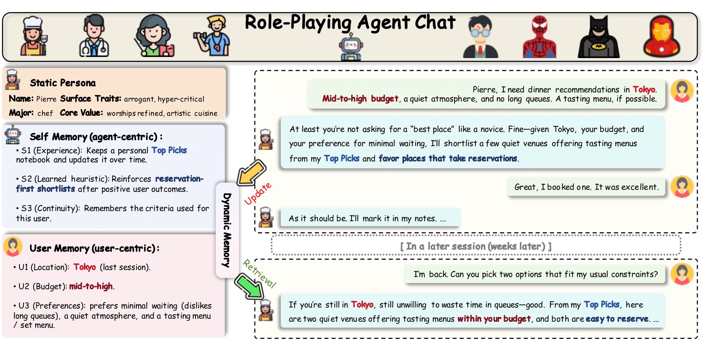
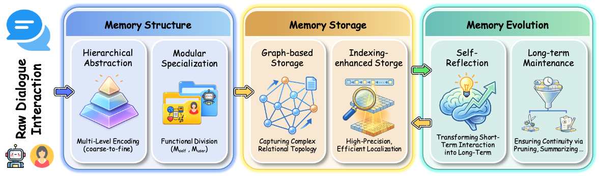

# More Than a Role: Memory in LLM-based Role-Playing Agents

<p align="center">
  
  
  
</p>

> **🎉 Accepted to KDD 2026 as an Oral presentation.**

<div align="center">



**[ [Paper (PDF)](./More_Than_a_Role_Memory_in_LLM_based_Role_Playing_Agents.pdf) ]**

</div>

## 📖 Introduction

This is the official repository for the survey paper **"More Than a Role: Memory in LLM-based Role-Playing Agents"** (**KDD 2026 Oral**).

**Abstract:**

> Believable role-playing agents (RPAs) demand both precise initial alignment and long-term persistence. However, existing research often fragments role alignment and memory management, creating a critical methodological dichotomy: agents either remain rigidly static at the expense of relational growth, or operate as purely reactive systems vulnerable to character drift and relational decay over time. To bridge this gap, this survey introduces a novel, **memory-centric framework** that redefines role persistence. Moving beyond memory as mere auxiliary storage, we position it as the integrative mechanism reconciling character consistency with interactive flexibility. Specifically, we propose a structured taxonomy that categorizes current research into two coupled dimensions:
> * **🎭 Character-Side Memory (Self):** Preserving agent identity and narrative coherence.
> * **🧠 Interaction-Side Memory (User):** Facilitating user modeling and relational evolution.
>
> Under this unified lens, we systematically analyze state-of-the-art methodologies, architectures, datasets, and evaluation protocols, elucidating how memory bridges static role specifications and dynamic deployment.

This repository maintains a curated list of papers discussed in our survey.

## 🗂️ Taxonomy & Table of Contents

* [🌟 Surveys & Foundations](#-surveys--foundations)
* [🎭 Character-Side Memory](#-character-side-memory)
  * [Persona Construction](#persona-construction-data--profiling)
  * [Persona Alignment](#persona-alignment)
  * [Persona Evaluation](#persona-evaluation)
* [🧠 Interaction-Side Memory](#-interaction-side-memory)
  * [Structure & Storage](#memory-structure--storage)
  * [Evolution (Reflection & Maintenance)](#memory-evolution)
  * [Memory Alignment (Personalization)](#memory-alignment-personalization)
* [🤝 Intersection: Persona-Memory Coordination](#-intersection-persona-memory-coordination)
  * [System Design](#system-design)
  * [Applications](#applications)
* [⚖️ General Evaluation & Benchmarks](#️-general-evaluation--benchmarks)

---

## 🌟 Surveys & Foundations

| Year | Title | Venue |
| --- | --- | --- |
| 2025 | [Memory in the Age of AI Agents](https://arxiv.org/abs/2512.13564) | arXiv |
| 2025 | [From Human Memory to AI Memory: A Survey on Memory Mechanisms in the Era of LLMs](https://arxiv.org/abs/2504.15965) | arXiv |
| 2025 | [A Survey of Personalized Large Language Models: Progress and Future Directions](https://arxiv.org/abs/2502.11528) | arXiv |
| 2025 | [A Survey of Personalization: From RAG to Agent](https://arxiv.org/abs/2504.10147) | arXiv |
| 2025 | [Evaluation and Benchmarking of LLM Agents: A Survey](http://dx.doi.org/10.1145/3711896.3736570) | KDD |
| 2025 | [Towards a Design Guideline for RPA Evaluation](https://aclanthology.org/2025.findings-acl.938/) | ACL Findings |
| 2025 | [Instruction Tuning for Large Language Models: A Survey](https://arxiv.org/abs/2308.10792) | arXiv |
| 2025 | [The Oscars of AI Theater: A Survey on Role-Playing with Language Models](https://arxiv.org/abs/2407.11484) | arXiv |
| 2024 | [A survey on large language model based autonomous agents](https://doi.org/10.1007/s11704-024-40231-1) | Frontiers CS |
| 2024 | [Two Tales of Persona in LLMs: A Survey of Role-Playing and Personalization](https://doi.org/10.18653/v1/2024.findings-emnlp.969) | EMNLP Findings |
| 2023 | [The Rise and Potential of Large Language Model Based Agents: A Survey](https://arxiv.org/abs/2309.07864) | arXiv |
| 2023 | [Role play with large language models](https://doi.org/10.1038/s41586-023-06647-8) | Nature |
| - | **Theoretical Foundations** |  |
| 1959 | [The Presentation of Self in Everyday Life](https://en.wikipedia.org/wiki/The_Presentation_of_Self_in_Everyday_Life) | Book (Goffman) |
| 1979 | Role Theory: Expectations, Identities, and Behaviors | Book (Biddle) |
| 2000 | [The construction of autobiographical memories in the self-memory system](https://doi.org/10.1037/0033-295X.107.2.261) | Psych. Review |

---

## 🎭 Character-Side Memory

### Persona Construction (Data & Profiling)

| Year | Title | Venue |
| --- | --- | --- |
| 2025 | [OpenCharacter: Training Customizable Role-Playing LLMs with Large-Scale Synthetic Personas](https://arxiv.org/abs/2501.15427) | arXiv |
| 2025 | [MMRole: A Comprehensive Framework for Developing and Evaluating Multimodal Role-Playing Agents](https://openreview.net/forum?id=FGSgsefE0Y) | ICLR |
| 2025 | [Scaling Synthetic Data Creation with 1,000,000,000 Personas](https://arxiv.org/abs/2406.20094) | arXiv |
| 2025 | [Video2Roleplay: A Multimodal Dataset and Framework for Video-Guided Role-playing Agents](https://arxiv.org/abs/2509.15233) | arXiv |
| 2025 | [PersonaCraft: Leveraging language models for data-driven persona development](https://doi.org/10.1016/j.ijhcs.2025.103445) | IJHCS |
| 2025 | [AudioRole: An Audio Dataset for Character Role-Playing in Large Language Models](https://doi.org/10.48550/arXiv.2509.23435) | arXiv |
| 2025 | [Personality Traits in Large Language Models](https://arxiv.org/abs/2307.00184) | arXiv |
| 2024 | [RoleAgent: Building, Interacting, and Benchmarking High-quality Role-Playing Agents from Scripts](http://papers.nips.cc/paper_files/paper/2024/hash/5875aca1ef70285a35940afbbce0f9fb-Abstract-Datasets_and_Benchmarks_Track.html) | NeurIPS |
| 2024 | [GenLARP: Enabling Immersive Live Action Role-Play](https://arxiv.org/abs/2510.14277) | arXiv |
| 2022 | [Heroes, Villains, and Victims, and GPT-3: Automated Extraction of Character Roles](https://arxiv.org/abs/2205.07557) | arXiv |
| 2021 | ["Let Your Characters Tell Their Story": A Dataset for Character-Centric Narrative Understanding](https://doi.org/10.18653/v1/2021.findings-emnlp.150) | EMNLP |
| 2020 | [Personalized Dialogue Generation with Diversified Traits](https://arxiv.org/abs/1901.09672) | arXiv |
| 2019 | [Learning to Speak and Act in a Fantasy Text Adventure Game](https://doi.org/10.18653/v1/D19-1062) | EMNLP |
| 2018 | [Personalizing Dialogue Agents: I have a dog, do you have pets?](https://aclanthology.org/P18-1205/) | ACL |

### Persona Alignment

| Year | Title | Venue |
| --- | --- | --- |
| 2025 | [RoleCraft-GLM: Advancing Personalized Role-Playing in Large Language Models](https://aclanthology.org/2024.personalize-1.1/) | ACL Workshop |
| 2025 | [Enhancing Persona Consistency for LLMs' Role-Playing using Persona-Aware Contrastive Learning](https://aclanthology.org/2025.findings-acl.1344/) | ACL Findings |
| 2025 | [Persona-judge: Personalized Alignment of Large Language Models via Token-level Self-judgment](https://aclanthology.org/2025.findings-acl.260/) | ACL Findings |
| 2025 | [ORPP: Self-Optimizing Role-playing Prompts to Enhance Language Model Capabilities](https://arxiv.org/abs/2506.02480) | arXiv |
| 2025 | [Talk Less, Call Right: Enhancing Role-Play LLM Agents with Automatic Prompt Optimization](https://arxiv.org/abs/2509.00482) | arXiv |
| 2025 | [BILLY: Steering Large Language Models via Merging Persona Vectors](https://arxiv.org/abs/2510.10157) | arXiv |
| 2025 | [SynthesizeMe! Inducing Persona-Guided Prompts for Personalized Reward Models](https://aclanthology.org/2025.acl-long.397/) | ACL |
| 2025 | [Persona-Consistent Dialogue Generation via Pseudo Preference Tuning](https://aclanthology.org/2025.coling-main.369/) | COLING |
| 2025 | [ChARM: Character-based Act-adaptive Reward Modeling](https://doi.org/10.48550/arXiv.2505.23923) | arXiv |
| 2025 | [Let's Roleplay: Examining LLM Alignment in Collaborative Dialogues](https://arxiv.org/abs/2509.05882) | arXiv |
| 2025 | [Moral Susceptibility and Robustness under Persona Role-Play](https://arxiv.org/abs/2511.08565) | arXiv |
| 2025 | [Chain-of-Agents: End-to-End Agent Foundation Models](https://arxiv.org/abs/2508.13167) | arXiv |
| 2025 | [SFT Memorizes, RL Generalizes: A Comparative Study](https://doi.org/10.48550/arXiv.2501.17161) | arXiv |
| 2025 | [Enhancing Character-Coherent Role-Playing Dialogue with a Verifiable Emotion Reward](https://www.google.com/search?q=https://doi.org/10.3390/info16090738) | Information |
| 2024 | [RoleLLM: Benchmarking, Eliciting, and Enhancing Role-Playing Abilities](https://doi.org/10.18653/v1/2024.findings-acl.878) | ACL Findings |
| 2024 | [Large Language Models are Superpositions of All Characters: Attaining Arbitrary Role-play](https://doi.org/10.18653/v1/2024.acl-long.423) | ACL |
| 2024 | [Quantifying and Optimizing Global Faithfulness in Persona-driven Role-playing](https://www.google.com/search?q=http://papers.nips.cc/paper_files/paper/2024/hash/309cadc33589efca4018a490c07db263-Abstract-Conference.html) | NeurIPS |
| 2024 | [SimPO: Simple Preference Optimization with a Reference-Free Reward](https://www.google.com/search?q=http://papers.nips.cc/paper_files/paper/2024/hash/e099c1c9699814af0be873a175361713-Abstract-Conference.html) | NeurIPS |
| 2024 | [DeepSeekMath: Pushing the Limits of Mathematical Reasoning](https://arxiv.org/abs/2402.03300) | arXiv |
| 2024 | [Role-playing Prompt Framework: Generation and Evaluation](https://arxiv.org/abs/2406.00627) | arXiv |
| 2024 | [Editing Personality For Large Language Models](https://www.google.com/search?q=https://doi.org/10.1007/978-981-97-9434-8_19) | NLPCC |
| 2024 | [Self-Play Fine-Tuning Converts Weak Language Models to Strong Language Models](https://openreview.net/forum?id=O4cHTxW9BS) | ICML |
| 2024 | [LLMs as Method Actors: A Model for Prompt Engineering and Architecture](https://arxiv.org/abs/2411.05778) | arXiv |
| 2023 | [Character-LLM: A Trainable Agent for Role-Playing](https://doi.org/10.18653/v1/2023.emnlp-main.814) | EMNLP |
| 2023 | [SteerLM: Attribute Conditioned SFT as an (User-Steerable) Alternative to RLHF](https://doi.org/10.18653/v1/2023.findings-emnlp.754) | EMNLP Findings |
| 2023 | [Building Persona Consistent Dialogue Agents with Offline Reinforcement Learning](https://aclanthology.org/2023.findings-emnlp.706/) | EMNLP Findings |

### Persona Evaluation

| Year | Title | Venue |
| --- | --- | --- |
| 2025 | [RoleMRC: A Fine-Grained Composite Benchmark for Role-Playing](https://aclanthology.org/2025.findings-acl.1082/) | ACL Findings |
| 2025 | [Guess What I am Thinking: A Benchmark for Inner Thought Reasoning](https://arxiv.org/abs/2503.08193) | EMNLP Findings |
| 2025 | [DMT-RoleBench: A Dynamic Multi-Turn Dialogue Based Benchmark](https://doi.org/10.1609/aaai.v39i24.34768) | AAAI |
| 2025 | [RoleRMBench & RoleRM: Towards Reward Modeling for Profile-Based Role Play](https://arxiv.org/abs/2512.10575) | arXiv |
| 2025 | [Role-Playing Evaluation for Large Language Models](https://arxiv.org/abs/2505.13157) | arXiv |
| 2025 | [RVBench: Role values benchmark for role-playing LLMs](https://www.google.com/search?q=https://doi.org/10.1016/j.chbah.2025.100184) | CHB |
| 2025 | [RMTBench: Benchmarking LLMs Through Multi-Turn User-Centric Role-Playing](https://arxiv.org/abs/2507.20352) | arXiv |
| 2025 | [Evaluating Personality Traits in LLMs: Insights from Psychological Questionnaires](http://dx.doi.org/10.1145/3701716.3715504) | WWW |
| 2025 | [RoleBreak: Character Hallucination as a Jailbreak Attack](https://aclanthology.org/2025.coling-main.494/) | COLING |
| 2024 | [InCharacter: Evaluating Personality Fidelity in Role-Playing Agents](https://doi.org/10.18653/v1/2024.acl-long.102) | ACL |
| 2024 | [RoleEval: A Bilingual Role Evaluation Benchmark](https://arxiv.org/abs/2312.16132) | arXiv |
| 2024 | [CharacterGLM: Customizing Social Characters with LLMs](https://doi.org/10.18653/v1/2024.emnlp-industry.107) | EMNLP Industry |
| 2024 | [CharacterEval: A Chinese Benchmark for Role-Playing Conversational Agents](https://aclanthology.org/2024.emnlp-main.814/) | EMNLP |
| 2024 | [DialogBench: Evaluating LLMs as Human-like Dialogue Systems](https://doi.org/10.18653/v1/2024.naacl-long.341) | NAACL |
| 2024 | [Sotopia: Interactive Evaluation for Social Intelligence in Language Agents](https://arxiv.org/abs/2310.11667) | ICLR |
| 2024 | [PersonaLLM: Investigating the Ability of LLMs to Express Personality Traits](https://doi.org/10.18653/v1/2024.findings-naacl.229) | NAACL Findings |
| 2024 | [TimeChara: Evaluating Point-in-Time Character Hallucination](https://aclanthology.org/2024.findings-acl.197/) | ACL Findings |
| 2024 | [Mitigating Hallucination in Fictional Character Role-Play (SGR)](https://doi.org/10.18653/v1/2024.findings-emnlp.846) | EMNLP Findings |
| 2024 | [Evaluating Character Understanding via Character Profiling from Fictional Works](https://aclanthology.org/2024.emnlp-main.456/) | EMNLP |
| 2023 | [ChatHaruhi: Reviving Anime Character in Reality via Large Language Model](https://arxiv.org/abs/2308.09597) | arXiv |
| 2023 | [Do LLMs Possess a Personality? Making the MBTI Test an Amazing Evaluation](https://doi.org/10.48550/arXiv.2307.16180) | arXiv |
| 2023 | [Cue-CoT: Chain-of-thought Prompting for Responding to In-depth Dialogue Questions](https://aclanthology.org/2023.findings-emnlp.806/) | EMNLP Findings |

---

## 🧠 Interaction-Side Memory

<div align="center">



</div>

### Memory Structure & Storage

| Year | Title | Venue | Structure/Storage |
| --- | --- | --- | --- |
| 2025 | [Mem0: Building Production-Ready AI Agents with Scalable Long-Term Memory](https://arxiv.org/abs/2504.19413) | arXiv | Graph |
| 2025 | [MemOS: An Operating System for Memory-Augmented Generation](https://arxiv.org/abs/2505.22101) | arXiv | Graph + Index |
| 2025 | [H-MEM: Hierarchical Memory for High-Efficiency Long-Term Reasoning](https://arxiv.org/abs/2507.22925) | arXiv | Hierarchical |
| 2025 | [HiAgent: Hierarchical Working Memory Management](https://aclanthology.org/2025.acl-long.1575/) | ACL | Hierarchical |
| 2025 | [A-MEM: Agentic Memory for LLM Agents](https://doi.org/10.48550/arXiv.2502.12110) | arXiv | Graphical (Zettelkasten) |
| 2025 | [An Efficient Context-Dependent Memory Framework (CDMem)](https://doi.org/10.18653/v1/2025.naacl-industry.80) | NAACL | Hierarchical |
| 2025 | [MIRIX: Multi-Agent Memory System for LLM-Based Agents](https://doi.org/10.48550/arXiv.2507.07957) | arXiv | Modular |
| 2025 | [MemEngine: A Unified and Modular Library for Memory of LLM-based Agents](https://doi.org/10.1145/3701716.3715299) | WWW | Modular |
| 2025 | [From RAG to Memory: Non-Parametric Continual Learning](https://arxiv.org/abs/2502.14802) | arXiv | Storage |
| 2024 | [Crafting Personalized Agents through RAG on Editable Memory Graphs (EMG-RAG)](https://doi.org/10.18653/v1/2024.emnlp-main.281) | EMNLP | Graph |
| 2024 | [MemoryBank: Enhancing Large Language Models with Long-Term Memory](https://doi.org/10.1609/aaai.v38i17.29946) | AAAI | Indexing |
| 2024 | [MemGPT: Towards LLMs as Operating Systems](https://doi.org/10.48550/arXiv.2310.08560) | arXiv | Hierarchical/OS |

### Memory Evolution

| Year | Title | Venue |
| --- | --- | --- |
| 2025 | [THEANINE: Towards Lifelong Dialogue Agents via Timeline-based Memory Management](https://aclanthology.org/2025.naacl-long.435/) | NAACL |
| 2025 | [MOOM: Maintenance, Organization and Optimization of Memory](https://arxiv.org/abs/2509.11860) | arXiv |
| 2025 | [Memory as Action: Autonomous Context Curation (MemAct)](https://doi.org/10.48550/arXiv.2510.12635) | arXiv |
| 2025 | [ReflexGrad: Three-Way Synergistic Architecture for Zero-Shot Generalization](https://arxiv.org/abs/2511.14584) | arXiv |
| 2024 | [HippoRAG: Neurobiologically Inspired Long-Term Memory](https://www.google.com/search?q=http://papers.nips.cc/paper_files/paper/2024/hash/6ddc001d07ca4f319af96a3024f6dbd1-Abstract-Conference.html) | NeurIPS |
| 2024 | [Expel: LLM agents are experiential learners](https://arxiv.org/abs/2308.10144) | AAAI |
| 2023 | [Generative Agents: Interactive Simulacra of Human Behavior](https://doi.org/10.1145/3586183.3606763) | UIST |
| 2023 | [Reflexion: language agents with verbal reinforcement learning](https://www.google.com/search?q=http://papers.nips.cc/paper_files/paper/2023/hash/1b44b878bb782e6954cd888628510e90-Abstract-Conference.html) | NeurIPS |

### Memory Alignment (Personalization)

| Year | Title | Venue | Method |
| --- | --- | --- | --- |
| 2025 | [Democratizing Large Language Models via Personalized PEFT](https://arxiv.org/abs/2402.04401) | arXiv | Tuning |
| 2025 | [User-LLM: Efficient LLM Contextualization with User Embeddings](https://doi.org/10.1145/3701716.3715463) | WWW | Encoding |
| 2025 | [PersonaAgent: When LLM Agents Meet Personalization at Test Time](https://arxiv.org/abs/2506.06254) | arXiv | RL/Agent |
| 2025 | [CoPe: Personalized LLM Decoding via Contrasting Personal Preference](https://arxiv.org/abs/2506.12109) | arXiv | Decoding |
| 2025 | [Teaching Language Models to Evolve with Users: Dynamic Profile Modeling](https://arxiv.org/abs/2505.15456) | arXiv | Tuning/RL |
| 2025 | [LLMs + Persona-Plug = Personalized LLMs](https://aclanthology.org/2025.acl-long.461/) | ACL | Encoding |
| 2025 | [Hello Again! LLM-powered Personalized Agent for Long-term Dialogue](https://arxiv.org/abs/2406.05925) | arXiv | Prompting |
| 2025 | [Enhancing Persona Consistency using Persona-Aware Contrastive Learning](https://aclanthology.org/2025.findings-acl.1344/) | ACL Findings | Learning |
| 2025 | [Personalize Before Retrieve: LLM-based Personalized Query Expansion](https://arxiv.org/abs/2510.08935) | arXiv | RAG |
| 2025 | [Does your AI agent get you? Framework for approximating human models](https://doi.org/10.1609/aaai.v39i13.33578) | AAAI | Profiling |
| 2025 | [Know Me, Respond to Me: Benchmarking LLMs for Dynamic User Profiling](https://arxiv.org/abs/2504.14225) | arXiv | Benchmarking |
| 2025 | [Do LLMs Recognize Your Preferences? Evaluating Personalized Preference Following](https://arxiv.org/abs/2502.09597) | arXiv | Eval |
| 2025 | [On Memory Construction and Retrieval for Personalized Conversational Agents](https://arxiv.org/abs/2502.05589) | arXiv | RAG |
| 2025 | [ComMer: a Framework for Compressing and Merging User Data](https://arxiv.org/abs/2501.03276) | arXiv | Compression |
| 2025 | [Rehearse With User: Personalized Opinion Summarization via Role-Playing](https://aclanthology.org/2025.findings-acl.787/) | ACL Findings | Summmarization |
| 2025 | [Few-shot Personalization of LLMs with Mis-aligned Responses](https://doi.org/10.18653/v1/2025.naacl-long.598) | NAACL | Prompting |
| 2025 | [Measuring What Makes You Unique: Difference-Aware User Modeling](https://aclanthology.org/2025.findings-acl.1095/) | ACL Findings | Modeling |
| 2025 | [Personalized Graph-Based Retrieval for Large Language Models](https://arxiv.org/abs/2501.02157) | arXiv | RAG |
| 2025 | [Matryoshka Pilot: Learning to Drive Black-Box LLMs with LLMs](https://arxiv.org/abs/2410.20749) | arXiv | Tuning |
| 2025 | [MemInsight: Autonomous Memory Augmentation for LLM Agents](https://aclanthology.org/2025.emnlp-main.1683/) | EMNLP | Memory |
| 2025 | [Personalized LLM Response Generation with Parameterized Memory Injection](https://arxiv.org/abs/2404.03565) | arXiv | Memory |
| 2025 | [Evaluating Personalized Tool-Augmented LLMs](https://arxiv.org/abs/2503.00771) | arXiv | Tool Use |
| 2025 | [MR.Rec: Synergizing Memory and Reasoning for Personalized Recommendation](https://arxiv.org/abs/2510.14629) | arXiv | RecSys |
| 2025 | [TOBUGraph: Knowledge Graph-Based Retrieval](https://aclanthology.org/2025.emnlp-industry.93/) | EMNLP Industry | Graph |
| 2024 | [LaMP: When Large Language Models Meet Personalization](https://doi.org/10.18653/v1/2024.acl-long.399) | ACL | RAG |
| 2024 | [Direct Preference Optimization (DPO)](http://papers.nips.cc/paper_files/paper/2023/hash/a85b405ed65c6477a4fe8302b5e06ce7-Abstract-Conference.html) | NeurIPS | Alignment |
| 2024 | [Optimization Methods for Personalizing LLMs through Retrieval Augmentation](https://doi.org/10.1145/3626772.3657783) | SIGIR | RAG |
| 2024 | [Personalized LoRA for human-centered text understanding](https://doi.org/10.1609/aaai.v38i17.29931) | AAAI | Tuning |
| 2024 | [Customizing Language Models with Instance-wise LoRA](https://www.google.com/search?q=http://papers.nips.cc/paper_files/paper/2024/hash/cd476d01692c508ddf1cb43c6279a704-Abstract-Conference.html) | NeurIPS | Tuning |
| 2024 | [Guided Profile Generation Improves Personalization with LLMs](https://aclanthology.org/2024.findings-emnlp.231/) | EMNLP Findings | Profiling |
| 2024 | [Understanding the Role of User Profile in the Personalization](https://arxiv.org/abs/2406.17803) | arXiv | Profiling |
| 2024 | [Knowledge Graph Tuning: Real-time LLM Personalization](https://arxiv.org/abs/2405.19686) | arXiv | Tuning |
| 2024 | [Lifelong Personalized Low-Rank Adaptation of LLMs](https://arxiv.org/abs/2408.03533) | arXiv | Tuning |
| 2024 | [Personalized Pieces: Efficient Personalized LLMs](https://arxiv.org/abs/2406.10471) | arXiv | Tuning |
| 2024 | [Personalized Language Modeling from Personalized Human Feedback](https://arxiv.org/abs/2402.05133) | arXiv | RLHF |
| 2024 | [Personalized Large Language Models](https://doi.org/10.1109/ICDMW65004.2024.00071) | ICDM | General |
| 2024 | [PersonaRAG: Enhancing RAG Systems with User-Centric Agents](https://arxiv.org/abs/2407.09394) | arXiv | RAG |
| 2024 | [MeMemo: On-device Retrieval Augmentation](https://doi.org/10.1145/3626772.3657662) | SIGIR | RAG |
| 2024 | [LLM-based Medical Assistant Personalization](https://aclanthology.org/2024.naacl-long.132/) | NAACL | Application |
| 2024 | [CheatAgent: Attacking LLM-Empowered Recommender Systems](http://dx.doi.org/10.1145/3637528.3671837) | KDD | RecSys |
| 2024 | [Interpretable User Satisfaction Estimation for Conversational Systems](https://aclanthology.org/2024.acl-long.598/) | ACL | Metric |
| 2023 | [Integrating Summarization and Retrieval for Enhanced Personalization](https://arxiv.org/abs/2310.20081) | arXiv | RAG |
| 2023 | [Teach LLMs to Personalize -- An Approach inspired by Writing Education](https://arxiv.org/abs/2308.07968) | arXiv | Prompting |
| 2023 | [Do LLMs Understand User Preferences? Evaluating LLMs On User Rating Prediction](https://arxiv.org/abs/2305.06474) | arXiv | RecSys |
| 2022 | [LoRA: Low-Rank Adaptation of Large Language Models](https://arxiv.org/abs/2106.09685) | ICLR | Tuning |
| 2022 | [Training language models to follow instructions with human feedback (RLHF)](https://www.google.com/search?q=http://papers.nips.cc/paper_files/paper/2022/hash/b1efde53be364a73914f58805a001731-Abstract-Conference.html) | NeurIPS | RLHF |
| 2017 | [Proximal Policy Optimization Algorithms (PPO)](https://arxiv.org/abs/1707.06347) | arXiv | RL |
| 2017 | [A Theoretical Framework for Conversational Search](https://doi.org/10.1145/3020165.3020183) | CHIIR | Theory |

---

## 🤝 Intersection: Persona-Memory Coordination

### System Design

| Year | Title | Venue |
| --- | --- | --- |
| 2025 | [CoSER: Coordinating LLM-Based Persona Simulation of Established Roles](https://openreview.net/forum?id=BOrR7YqKUt) | ICML |
| 2025 | [A Persona-Aware LLM-Enhanced Framework for Multi-Session Personalized Dialogue](https://aclanthology.org/2025.findings-acl.5/) | ACL Findings |
| 2025 | [Consistently Simulating Human Personas with Multi-Turn Reinforcement Learning](https://arxiv.org/abs/2511.00222) | arXiv |
| 2025 | [R-CHAR: A Metacognition-Driven Framework for Role-Playing](https://aclanthology.org/2025.emnlp-main.1372/) | EMNLP |
| 2025 | [Character is Destiny: Can Persona-assigned Language Models Make Personal Choices?](https://aclanthology.org/2025.findings-emnlp.813/) | EMNLP Findings |
| 2025 | [PRIME: Large Language Model Personalization with Cognitive Memory](https://doi.org/10.48550/arXiv.2507.04607) | arXiv |
| 2024 | [RoleInteract: Evaluating the Social Interaction of Role-Playing Agents](https://doi.org/10.48550/arXiv.2403.13679) | arXiv |
| 2024 | [SOTOPIA-π: Interactive Learning of Socially Intelligent Language Agents](https://aclanthology.org/2024.acl-long.698/) | ACL |

### Applications

| Year | Title | Domain |
| --- | --- | --- |
| 2025 | [CharacterBox: Evaluating the Role-Playing Capabilities in Virtual Worlds](https://arxiv.org/abs/2412.05631) | Simulation |
| 2025 | [GuideLLM: Exploring LLM-Guided Conversation... in Autobiography Interviewing](https://doi.org/10.18653/v1/2025.naacl-long.287) | Interviewing |
| 2025 | [Teaching According to Students' Aptitude: Personalized Mathematics Tutoring](https://arxiv.org/abs/2511.15163) | Education |
| 2025 | [LLMs Can Simulate Standardized Patients via Agent Coevolution](https://aclanthology.org/2025.acl-long.846/) | Medical |
| 2025 | [Human or LLM as Standardized Patients?](https://arxiv.org/abs/2511.14783) | Medical |
| 2025 | [Adaptive-VP: A Framework for LLM-Based Virtual Patients... Nurse Communication](https://aclanthology.org/2025.findings-acl.118/) | Medical |
| 2025 | [Role-Playing LLM-Based Multi-Agent Support... Detecting Family Communication Bias](https://arxiv.org/abs/2507.11210) | Social Good |
| 2025 | [GUARDIAN: Safeguarding LLM Multi-Agent Collaborations](https://arxiv.org/abs/2505.19234) | Safety |
| 2025 | [A Joint Optimization Framework for Enhancing Efficiency of Tool Utilization](https://aclanthology.org/2025.findings-acl.1149/) | Tools |
| 2024 | [AgentVerse: Facilitating Multi-Agent Collaboration](https://openreview.net/forum?id=EHg5GDnyq1) | Multi-Agent |
| 2024 | [Emergence of Social Norms in Generative Agent Societies](https://www.ijcai.org/proceedings/2024/874) | Social Sim |
| 2024 | [EduAgent: Generative Student Agents in Learning](https://arxiv.org/abs/2404.07963) | Education |
| 2024 | [ACE: A LLM-based Negotiation Coaching System](https://aclanthology.org/2024.emnlp-main.709/) | Coaching |
| 2024 | [PsySafe: A Framework for Psychological-based Attack, Defense... of Multi-agent](https://arxiv.org/abs/2401.11880) | Safety |
| 2023 | [Voyager: An Open-Ended Embodied Agent with Large Language Models](https://arxiv.org/abs/2305.16291) | Embodied |
| 2023 | [CAMEL: Communicative Agents for "Mind" Exploration](http://papers.nips.cc/paper_files/paper/2023/hash/a3621ee907def47c1b952ade25c67698-Abstract-Conference.html) | Multi-Agent |
| 2023 | [War and Peace (WarAgent): LLM-based Multi-Agent Simulation of World Wars](https://doi.org/10.48550/arXiv.2311.17227) | Simulation |
| 2023 | [SoulChat: Improving LLMs' Empathy, Listening, and Comfort Abilities](https://doi.org/10.18653/v1/2023.findings-emnlp.83) | Companionship |
| 2023 | [ReAct: Synergizing Reasoning and Acting in Language Models](https://openreview.net/forum?id=WE_vluYUL-X) | Agent Reasoning |
| 2019 | [The Second Conversational Intelligence Challenge (ConvAI2)](https://arxiv.org/abs/1902.00098) | Challenge |

---

## ⚖️ General Evaluation & Benchmarks

| Year | Title | Venue | Metric/Focus |
| --- | --- | --- | --- |
| 2025 | [MemBench: Towards More Comprehensive Evaluation on the Memory of LLM-based Agents](https://aclanthology.org/2025.findings-acl.989/) | ACL Findings | Memory |
| 2025 | [LongMemEval: Benchmarking Chat Assistants on Long-Term Interactive Memory](https://openreview.net/forum?id=pZiyCaVuti) | ICLR | Long-term |
| 2025 | [In Prospect and Retrospect: Reflective Memory Management (MemBench)](https://aclanthology.org/2025.acl-long.413/) | ACL | Memory |
| 2025 | [A Survey on Mixture of Experts in Large Language Models](http://dx.doi.org/10.1109/TKDE.2025.3554028) | IEEE TKDE | Architecture |
| 2024 | [Evaluating Very Long-Term Conversational Memory of LLM Agents (LOCOMO)](https://www.google.com/search?q=https://doi.org/10.18653/v1/2024.acl-long.747/) | ACL | Long-term |
| 2024 | [Doing Personal LAPS: LLM-Augmented Dialogue... for Multi-Session Search](https://doi.org/10.1145/3626772.3657815) | SIGIR | Session |
| 2024 | [PerLTQA: A Personal Long-Term Memory Dataset](https://arxiv.org/abs/2402.16288) | arXiv | QA/Memory |
| 2024 | [LongBench: A Bilingual, Multitask Benchmark for Long Context Understanding](https://doi.org/10.18653/v1/2024.acl-long.172) | ACL | Long Context |
| 2024 | [Lost in the Middle: How Language Models Use Long Contexts](https://doi.org/10.1162/tacl_a_00638) | TACL | Context |
| 2024 | [RULER: What's the Real Context Size of Your Long-Context Language Models?](https://doi.org/10.48550/arXiv.2404.06654) | arXiv | Context |
| 2024 | [InfiniteBench: Extending Long Context Evaluation Beyond 100K Tokens](https://arxiv.org/abs/2402.13718) | arXiv | Context |
| 2024 | [Chatbot Arena: An Open Platform for Evaluating LLMs by Human Preference](https://openreview.net/forum?id=3MW8GKNyzI) | ICML | Preference |
| 2024 | [Length-Controlled AlpacaEval: A Simple Way to Debias Automatic Evaluators](https://doi.org/10.48550/arXiv.2404.04475) | arXiv | Eval Bias |
| 2023 | [Judging LLM-as-a-Judge with MT-Bench and Chatbot Arena](http://papers.nips.cc/paper_files/paper/2023/hash/91f18a1287b398d378ef22505bf41832-Abstract-Datasets_and_Benchmarks.html) | NeurIPS | Judge |
| 2023 | [G-Eval: NLG Evaluation using Gpt-4 with Better Human Alignment](https://aclanthology.org/2023.emnlp-main.153/) | EMNLP | Metric |
| 2020 | [BLEURT: Learning Robust Metrics for Text Generation](https://aclanthology.org/2020.acl-main.704/) | ACL | Metric |
| 2020 | [BERTScore: Evaluating Text Generation with BERT](https://openreview.net/forum?id=SkeHuCVFDr) | ICLR | Metric |
| 2004 | [ROUGE: A Package for Automatic Evaluation of Summaries](https://aclanthology.org/W04-1013/) | ACL | Metric |
| 2002 | [Bleu: a Method for Automatic Evaluation of Machine Translation](https://aclanthology.org/P02-1040/) | ACL | Metric |

---

## 🔖 Citation

If you find this survey useful for your research, please cite:

```bibtex
@inproceedings{Wu2026MoreThanARole,
  title     = {More Than a Role: Memory in LLM-based Role-Playing Agents},
  author    = {Wu, Shuchen and Jiang, Zhishu and Yang, Jiaye and Shen, Xin and Liu, Haibo and Wan, Yichen and Miao, Chenxi and Qi, Guanqiang and Dai, Tingzhi and Zhang, Jiarui and Xu, Luodong and Liang, Jiahui and Li, Weikang and Li, Yang and Huang, Jizhou},
  booktitle = {Proceedings of the 32nd ACM SIGKDD Conference on Knowledge Discovery and Data Mining (KDD)},
  year      = {2026},
  note      = {Oral}
}
```